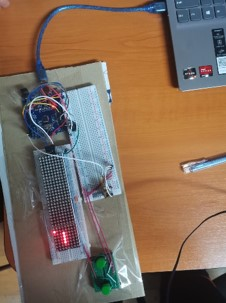
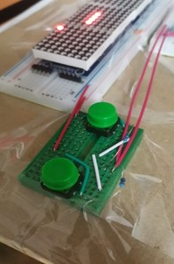
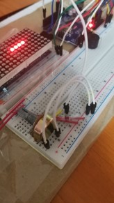
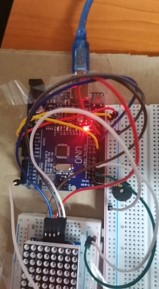

# Arduino Projects Repository

## Overview

Welcome to the Arduino Projects repository! This repository contains a collection of small projects showcasing various Arduino functionalities and components. From basic displays to advanced communication protocols, you'll find examples to help you learn and experiment with Arduino.

## Projects Included

### 1. 7 Segment Displays
- Demonstration of how to control 7-segment displays to display numbers and characters.

### 2. LCD Displays
- Examples of interfacing with LCD displays to show text, numbers, and custom characters.

### 3. Music Playing with Buzzer
- Play iconic melodies such as "Fur Elise" and the "Harry Potter" theme using the tone function with a buzzer.

### 4. WiFi Communication on ESP32
- Guide on setting up WiFi communication and performing basic operations with the ESP32 board.

### 5. I2C Communication
- Examples demonstrating inter-communication between multiple Arduino boards using the I2C protocol.

### 6. SPI Communication
- Demonstrations of Serial Peripheral Interface (SPI) communication between Arduino boards and peripheral devices.

### 7. Game of Snake on 8x8 LED Matrices
- Implementation of the classic game of Snake using cascaded 8x8 LED matrices.

## Getting Started

### Prerequisites
- Arduino IDE installed on your computer.
- Basic understanding of Arduino programming.

### Installation
1. Clone the repository: `git clone https://github.com/AndreiE91/Arduino_Projects`
2. Open each project folder in the Arduino IDE.
3. Upload the code to your Arduino board.

## Contributing

Contributions to this repository are welcome! If you'd like to add a new project or improve existing ones, please follow these steps:
1. Fork the repository.
2. Create a new branch (`git checkout -b feature/your-feature`).
3. Make your changes.
4. Commit your changes (`git commit -m 'Add some feature'`).
5. Push to the branch (`git push origin feature/your-feature`).
6. Create a new Pull Request.

## Contact

For any inquiries or support regarding the projects, please contact eminoviciandrei777@yahoo.com.

## Acknowledgements

Special thanks to the Arduino community for their valuable contributions and resources.

